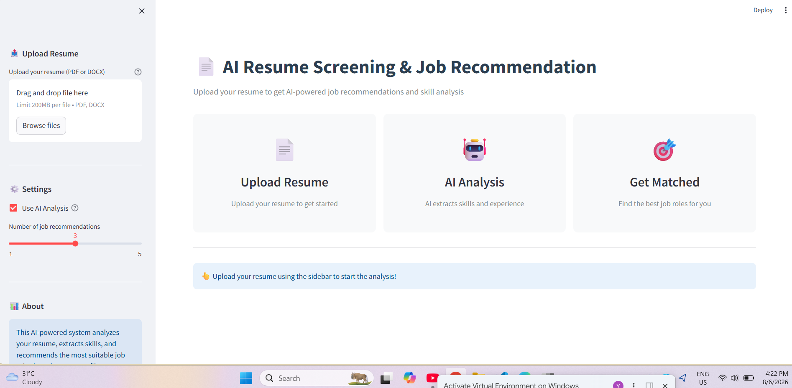
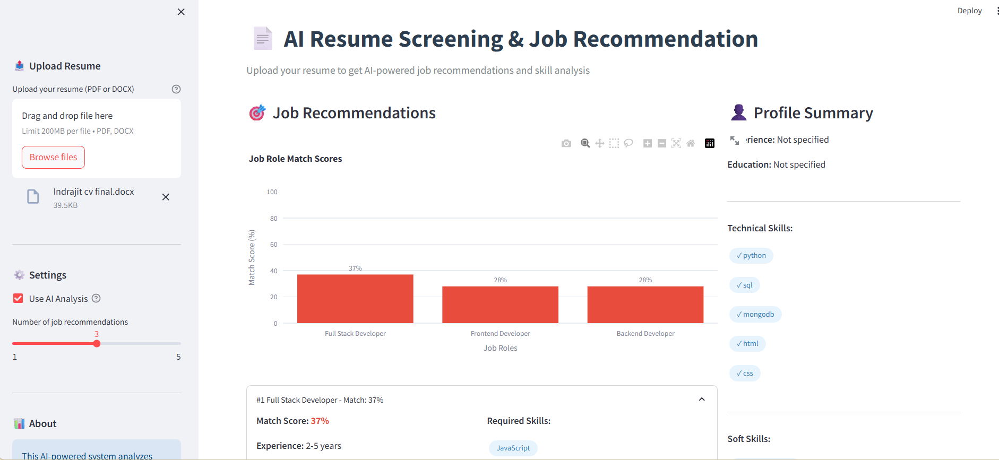
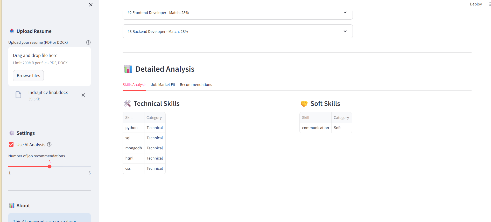
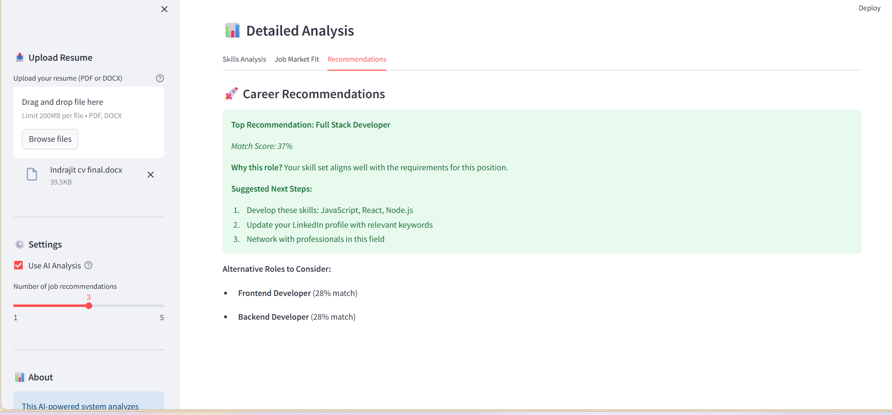

# 📄 AI Resume Screening & Job Recommendation System

An intelligent, interactive application that analyzes resumes and recommends suitable job roles using AI. It provides a complete AI-powered resume screening solution with a polished user interface, helping candidates find their perfect job match while identifying key skill gaps.

---

## ✨ Key Features

- **⚡ One-Click Intelligent Router (`run.bat`)**: Automatically detects/creates Python virtual environment, activates it, auto-installs dependencies, checks `.env`, and launches Streamlit.
- **🎨 Custom Styled Dashboard**: Clean, modern interface styled for clear data visualization and smooth navigation.
- **📤 Resume Upload**: Supports PDF and DOCX formats with drag-and-drop capability.
- **🔍 Text Extraction**: Automatically extracts text using `PyPDF2`, `pdfplumber`, and `python-docx`.
- **🧠 AI Analysis**: Uses OpenAI GPT-4 to deeply analyze and extract Technical/Soft skills, Experience, Education, and a Professional Profile Summary.
- **🎯 Job Matching & Recommendation**: Advanced match scoring algorithm compares extracted skills with job requirements to find the best fit.
- **🚀 Missing Skills Analysis**: Identifies critical skill gaps needed for recommended roles to help users upskill.
- **📊 Performance & Visualization**: Clean, responsive, interactive Plotly charts showing real-time match scores and skill gaps.
- **🛡️ Error Handling**: Graceful fallbacks for invalid file formats, large files, API errors, and missing keys.

---

## 📑 Table of Contents

- [Features](#-key-features)
- [Screenshots](#-screenshots)
- [Tech Stack](#-tech-stack)
- [Installation](#-installation)
- [Quick Start](#-quick-start)
- [Project Structure](#-project-structure)
- [Usage](#-usage)
- [Customization](#-customization)
- [Contributing](#-contributing)
- [License](#-license)
- [Contact](#-contact)

---

## 📸 Screenshots

### 1. Landing & Resume Upload


### 2. Job Recommendations & Profile Summary


### 3. Detailed Skills Breakdown


### 4. Career Recommendations & Next Steps


---

## 🛠 Tech Stack

- **Frontend**: Streamlit
- **AI/ML**: OpenAI API (GPT-4), LangChain
- **Document Processing**: PyPDF2, pdfplumber, python-docx
- **Data Visualization**: Plotly, Pandas

---

## 🚀 Installation

### Prerequisites

- Git (for cloning)
- Python 3.10+
- pip package manager

### Clone Repository

```bash
git clone [https://github.com/KushwahaVijay11/resume_screening_app.git](https://github.com/KushwahaVijay11/resume_screening_app.git)
cd resume_screening_app

```

### Set Up Virtual Environment

```powershell
python -m venv venv

```

### Activate Virtual Environment

**On Windows (PowerShell):**

```powershell
.\venv\Scripts\Activate.ps1

```

### Install Dependencies

```bash
pip install -r requirements.txt

```

### Set Up Environment Variables

Create a `.env` file in the root directory and add your OpenAI API key:

```env
OPENAI_API_KEY=your_actual_api_key_here

```

---

## ⚡ Quick Start

### 1. Run the Application

On Windows (Recommended one-click setup):

```cmd
run.bat

```

Or manually:

```bash
streamlit run app.py

```

### 2. Open in Browser

Navigate to: `http://localhost:8501`

### 3. Upload & Analyze

1. Drag & drop or upload your resume (PDF/DOCX) via the sidebar.
2. Select whether to use AI Analysis and adjust top recommendations slider.
3. View real-time match scores, missing skills, and personalized career advice!

---

## 📁 Project Structure

```text
resume_screening_app/
├── docs/
│   └── images/                    # Documentation screenshots
│       ├── landing_page.png
│       ├── match_scores.png
│       ├── detailed_analysis.png
│       └── career_recommendations.png
│
├── utils/
│   ├── resume_parser.py           # Resume text extraction logic
│   ├── ai_analyzer.py             # OpenAI API & LangChain integration
│   └── job_matcher.py             # Match score calculation algorithms
│
├── data/
│   └── job_roles.json             # Job role database
│
├── .env                           # API Key configuration
├── .gitignore                     # Git untracked files
├── app.py                         # Main Streamlit application
├── requirements.txt               # Python dependencies
├── run.bat                        # One-click Windows launcher
└── README.md                      # Documentation

```

---

## 💡 Usage

### Running Programmatically / Utilities

```python
from utils.resume_parser import extract_text_from_resume
from utils.ai_analyzer import analyze_resume_with_ai

# Extract raw text from file
text = extract_text_from_resume("sample_resume.pdf")

# Perform AI extraction
analysis = analyze_resume_with_ai(text)
print("Skills Found:", analysis["technical_skills"])

```

---

## ⚙️ Customization

### Adding New Job Roles

You can easily add or modify job roles by updating `data/job_roles.json`:

```json
{
  "title": "Full Stack Developer",
  "required_skills": ["Python", "JavaScript", "React", "Node.js", "SQL"],
  "experience": "2-5 years",
  "education": "Bachelor's in Computer Science or related field"
}

```

---

## 🤝 Contributing

Contributions are welcome! Please follow these steps:

1. Fork the repository
2. Create a feature branch (`git checkout -b feature/AmazingFeature`)
3. Commit your changes (`git commit -m 'Add AmazingFeature'`)
4. Push to the branch (`git push origin feature/AmazingFeature`)
5. Open a Pull Request

---

## 📄 License

This project is licensed under the MIT License - see the `LICENSE` file for details.

---

## 📧 Contact

**VIJAY SINGH**

🎓 Computer Science and Engineering

🏛️ Madan Mohan Malaviya University of Technology (MMMUT) - Gorakhpur, Uttar Pradesh, India

* 🐙 **GitHub:** [@KushwahaVijay11](https://github.com/KushwahaVijay11)
* 💼 **LinkedIn:** [Vijay Kushwaha](www.linkedin.com/in/kushwahavijay11/)
* 📧 **Email:** vijaysinghtikampar@gmail.com

Feel free to reach out if you have any questions or want to collaborate on AI and Machine Learning projects!

